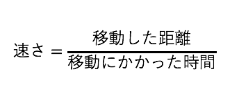

# 速さと速度
## 速さ


```
黒板

100mを10秒で走るAさんと、300mを50秒で走るBさん、
どっちが速い？
```

んー、100m10秒って、日本記録だよねぇ笑

でも、そこは物理の問題と割り切って、どうすれば比べられるか考えよう。

```
黒板

二人が同じ時間だけ走ったら、
どれだけ進めるか考えればいい！
```

それが、**速さ**を求めるということだ。  
つまり、速さとは、**単位時間当たりに物体が移動した距離**をさすのである。

求め方(物体Aの速さ)



そして、物理は国境を越えるので(?)、誰もが式を見たらその意味が分かるようにしたい。  
だから、「速さ」や「移動した距離」をアルファベットで書くこととしよう。
速さは英語でvelocityだからv、距離は、数学を思い出してx、時間は英語でtimeだからtを使おう。そうすると上の式は

$$v=\frac{x}{t}$$

となる。どうだ、かっこいいだろう!?

## 平均の速さと瞬間の速さ

実は、速さには二種類ある。

```
黒板  

平均の速さ
移動した距離を、かかった時間で割って求める。  
 
瞬間の速さ
その瞬間瞬間の速さのこと。  
車のスピードメーターが示している速さみたいな。

```

平均の速さについてもう少し説明しよう。  
移動中に休憩時間をとったり、加速・減速を繰り返しても、それは気にしないということだ。  
例えば、新幹線は東京から新大阪までを2時間30分で移動する。東京から新大阪までの距離が500kmなので、割り算すれば速さが求められる。  

これが、平均の速さなのだ。はっはっは。 

## 速度と速さの違い

さぁ、高校物理の鬼門その1だ。しっかりおさえよう。  
そもそも、物理量（それこそ速さとか速度とか、性質や状態を示す量をひっくるめて物理量という。）には二種類ある。

```
黒板

ベクトル...向きと大きさの両方を兼ね備えた量。
スカラー...大きさのみを持つ量

```

これらが何を意味するかは、速さと速度の説明をすればなんとなくわかるだろう。

```
黒板

速さ...単位時間あたりに物体が進む距離
速度...向きと速さの両方を合わせた量
```

例えば、下の図を見てもらいたい。これは、Aさんが北向きに秒速1メートルで歩いているところを示している。
  
さて、Aさんの速さと速度はいくらか。という問題が出たとしよう。

まず、速さだが、これはいうまでもなく、秒速1メートルだ。だってそれしか速さを示す量が書いてないからね。
では速度はどうだろう。黒板の説明をよーく見てもらいたい。  
<div style="text-align:center";>
速度...*向きと速さの両方を合わせた量*  
</div>
と書いてある。だから答えは、ちょっと面倒だけどこうだ。  

<div style="text-align:center";>
北向きに秒速1メートル  
</div>

これなら、向きと速さ、両方書いてあるから問題ない。  
ちょっとかったるいけど、速度と速さは明確に違いがあるから、覚えておこう。

そして、速度は**ベクトル**であること、速さは**スカラー**であることも覚えておこう。  
詳しい説明は、ベクトルとスカラーの黒板を見ること。

## 変位と距離

同じベクトルとスカラーの話で、変位と距離も出てくるので紹介しておこう。  
下の図は、反復横跳びの線を横から見た図で、真ん中から正の向き、負の向きにそれぞれ1メートル離れたところに線があるとする。  


 


```
黒板

変位...始めの位置と終わりの位置の変化。（ベクトル量）
距離...物体がどれだけ進んだかを表す量。（スカラー）

```
  
  
例えば、Aさんが図の一番最初に真ん中にいたとする。  
Aさんが正の向きに1メートル進んだとする。そうした時、Aさんが運動した距離はまぁ間違いなく1メートルである。   
では、変位は？ベクトル量ということは、向きと大きさ、両方答えないといけないね。ということは？
<div style="text-align:center";>
正の向きに1メートル  
</div>
と答えなきゃいけないのだ。じゃあ、中心（0の位置）Aさんが反復横跳びで1往復（というのが正しい言い方なのかわからないが)して、また最初の位置に戻ってきたとする。ではその時の距離と変位は？ちょっと考えてみよう。

<details><summary>答え</summary><div>  

距離...右に1メートル、戻って1メートル、左に1メートル、戻って1メートルだから、答えは**4メートル**

変位
始めは0の位置にいて、終わりも0の位置にいることになる。つまり、始めの位置と終わりの位置で変化していないのだ。  
だから答えは**0**

</div></details>

計算というより、言葉の説明の方が多かったかな。あまり物理感がないかもしれないけど、本番はこれから...  

<div style="text-align:right";>
To be continued...
</div>